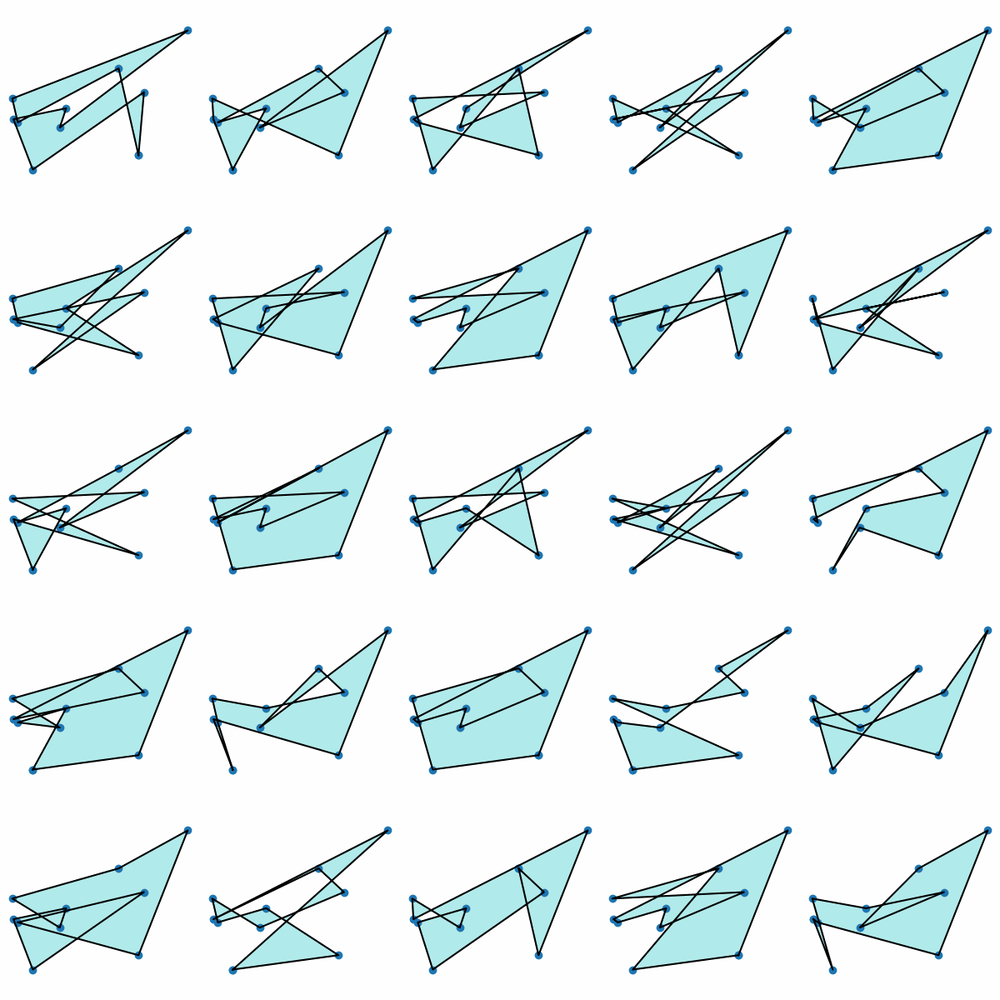
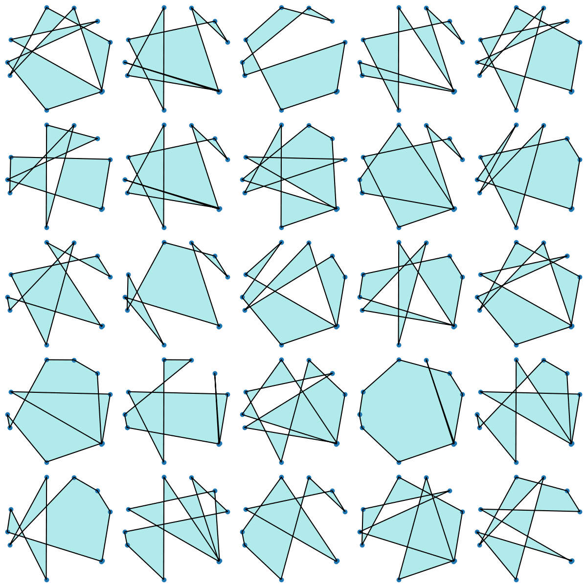

# ga-demo

This repository demonstrates a basic implementation of a Genetic Algorithm (GA).

 <a href="https://colab.research.google.com/github/mark-hobbs/ga-demo/blob/main/demo.ipynb" target="_parent"></a>

## Problem statement

Given a set of points in 2D space, determine the polygon that maximises the ratio of its area to the square of its perimeter $(\text{Area}/\text{Perimeter}^2)$. This ratio serves as a measure of compactness, which is often desirable in various fields such as materials science, biology, and urban planning. Compact shapes can lead to more efficient designs, reduced material usage, and optimised spatial arrangements.

## Example solutions

The following animations demonstrate the evolution of the polygon shapes over many generations.

**Example 1**



**Example 2**



## Usage

### 1. Clone the repository and activate the virtual environment

Clone the repository and install the necessary dependencies using `pipenv`.

```bash
git clone https://github.com/mark-hobbs/ga-demo.git
cd ga-demo
pipenv install
pipenv shell
```

### 2. Run the genetic algorithm demonstration

Execute the demo script to run the genetic algorithm and output an animation illustrating the evolution of the population towards optimal solutions.

```bash
python demo.py
```

`demo.py` contains the following logic. The values can be edited as desired:

#### 1. Generate random points

Start by generating 10 random points.

```python
n_points = 10
points = [Point(np.random.rand(), np.random.rand()) for _ in range(n_points)]
```

#### 2. Generate the initial population of polygons

Create an initial population of 25 polygons using the generated points.

```python
population_size = 25
individuals = [Polygon(np.random.permutation(points)) for _ in range(population_size)]
population = Population(individuals)
```

#### 3. Initiate the genetic algorithm

Set up the Genetic Algorithm with the initial population, number of generations, number of parents, and mutation probability. You can also enable animation.

```python
ga = GeneticAlgorithm(
    population=population,
    num_generations=100,
    num_parents=4,
    mutation_probability=0.05,
    animate=True,
)
```

#### 4. Perform the evolution

Run the genetic algorithm to evolve the population towards optimal solutions.

```python
ga.evolve()
```

### 3. Run the genetic algorithm demonstration as a notebook

Run the demonstration as a notebook to easily modify the parameters and explore their influence on the final results.

```bash
jupyter lab demo.ipynb
```

Or you can run the notebook using Google Colab: 

<a href="https://colab.research.google.com/github/mark-hobbs/ga-demo/blob/main/demo.ipynb" target="_parent"></a>

## License

This project is licensed under the MIT License. See the [LICENSE](LICENSE) file for details.