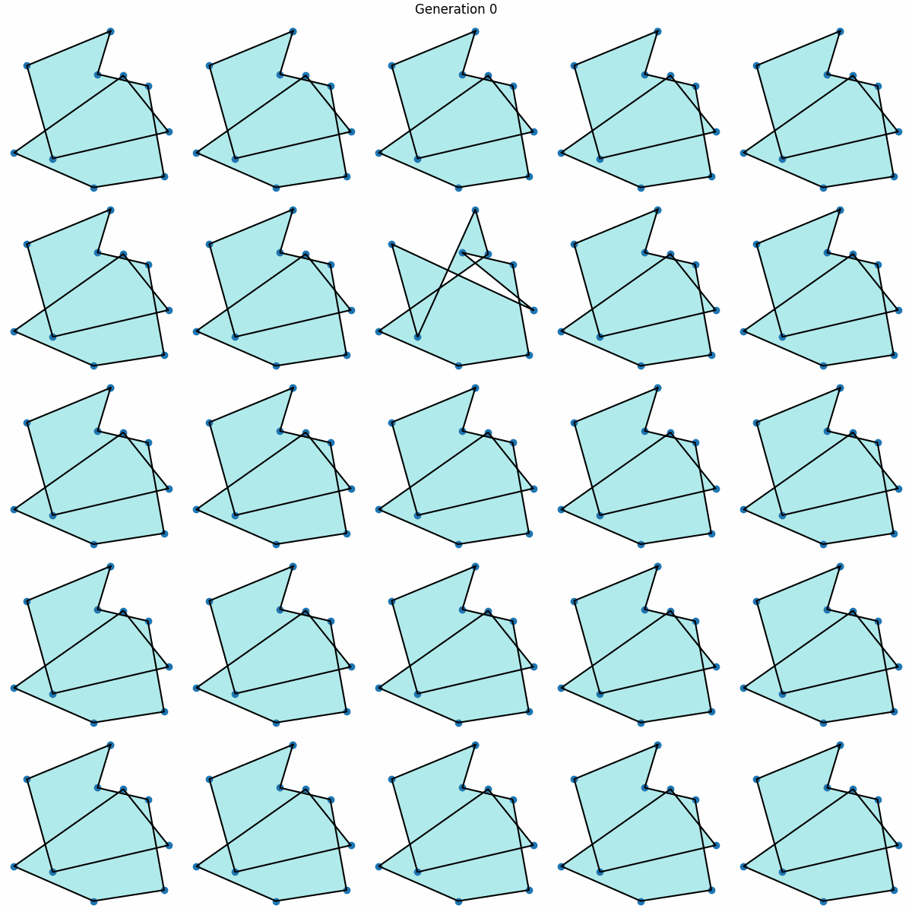

# ga-demo

This repository demonstrates a basic implementation of a Genetic Algorithm (GA).

### Problem statement

Given a set of points in 2D space, determine the polygon that maximises the ratio of its area to the square of its perimeter $(\text{Area}/\text{Perimeter}^2)$. This ratio serves as a measure of compactness, which is often desirable in various fields such as materials science, biology, and urban planning. Compact shapes can lead to more efficient designs, reduced material usage, and optimised spatial arrangements.

